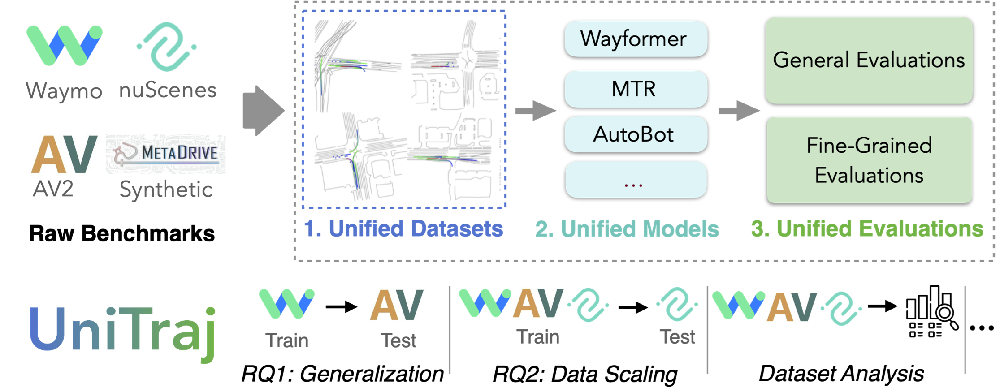

# DLAV — Deep Learning for Autonomous Vehicles

This repository contains coursework and projects completed for the **Deep Learning for Autonomous Vehicles (DLAV)** course at EPFL. The projects cover trajectory prediction with transformers, image classification with linear models and neural networks, and convolutional neural networks for visual recognition.



## Overview

The repository is organized into three main assignments:

| Homework | Topic                         | Main Technologies                                            |
| -------- | ----------------------------- | ------------------------------------------------------------ |
| HW1      | Vehicle trajectory prediction | Transformers, Self-Attention, PyTorch                        |
| HW2      | Image classification          | Softmax Regression, Fully Connected Neural Networks, PyTorch |
| HW3      | Convolutional Neural Networks | CNNs, CIFAR-10, PyTorch                                      |

---

# HW1 — Vehicle Trajectory Prediction with UniTraj

## Project Description

This project builds upon **UniTraj**, a unified framework for vehicle trajectory prediction developed by the VITA Lab at EPFL.

The objective was to complete and train a **Predictive Transformer (PTR)** model capable of forecasting future vehicle trajectories from:

* Past agent trajectories
* Interactions between surrounding agents
* Road and map information

The model was evaluated using the **MinADE6** metric (Minimum Average Displacement Error).

## Framework

The project is based on:

**UniTraj: A Unified Framework for Scalable Vehicle Trajectory Prediction**

Authors:

* Lan Feng
* Mohammadhossein Bahari
* Kaouther Messaoud Ben Amor
* Éloi Zablocki
* Matthieu Cord
* Alexandre Alahi

Accepted at ECCV 2024.

## Implemented Components

### Temporal Attention

Implemented temporal self-attention layers to capture dependencies across time.

Features:

* Sinusoidal positional encoding
* Multi-head temporal attention
* Padding masks to prevent invalid attention operations
* Tensor reshaping between transformer and trajectory representations

Input tensor:

```text
[T, B, N, H]
```

where:

* T = time steps
* B = batch size
* N = number of agents
* H = embedding dimension

### Social Attention

Implemented social attention layers to model interactions between agents.

Features:

* Attention across agents at each time step
* Masking of absent agents
* Social-context-aware embeddings
* Reshaping for efficient transformer processing

### Encoder Completion

Completed the PTR encoder by combining:

1. Positional Encoding
2. Temporal Attention
3. Social Attention

across multiple transformer layers.

---

## Hyperparameter Optimization

Several training configurations were evaluated.

| Version | Learning Rate | Scheduler       | Max Samples | Epochs | MinADE6 |
| ------- | ------------- | --------------- | ----------- | ------ | ------- |
| V1      | 0.002         | Every 5 epochs  | 10,000      | 100    | 2.726   |
| V2      | 0.00075       | Every 5 epochs  | 500,000     | 50     | 1.191   |
| V3      | 0.0006        | Every 10 epochs | 1,000,000   | 100    | 1.007   |

### Best Result

The final configuration achieved:

```text
MinADE6 = 1.007
```

and obtained:

```text
Kaggle MinADE6 = 1.023
```

Key findings:

* Increasing dataset size significantly improved generalization.
* Learning-rate scheduling had limited impact.
* Lower learning rates improved convergence stability.
* Longer training improved trajectory prediction quality.

---

## Visualization

The framework provides trajectory visualizations through:

```bash
python generate_predictions.py method=ptr
```

Generated visualizations include:

* Historical trajectories
* Predicted trajectories
* Road geometry
* Surrounding agent context

These visualizations helped identify scenarios where the model performs well and situations where limited environmental information leads to higher prediction uncertainty.

---

# HW2 — Image Classification

## Part I: Softmax Classifier

Implemented a Softmax Regression classifier on CIFAR-10.

### Tasks

* Data loading and preprocessing
* Softmax loss implementation
* Gradient computation
* SGD optimization
* Hyperparameter tuning

### Results

| Learning Rate | Validation Accuracy |
| ------------- | ------------------- |
| 1e-7          | Lower performance   |
| 5e-4          | 40.5%               |

Best validation accuracy:

```text
40.5%
```

---

## Part II: Fully Connected Neural Network

Implemented a neural network in PyTorch consisting of:

```text
Input (3072)
    ↓
Linear (300)
    ↓
ReLU
    ↓
Linear (300)
    ↓
ReLU
    ↓
Output (10)
```

### Hyperparameters

* Optimizer: SGD
* Learning rate: 8e-3

### Results

Validation accuracy:

```text
50–53%
```

---

## Part III: Model Comparison

### Softmax Regression

Test accuracy:

```text
39.75%
```

### Fully Connected Network

Test accuracy:

```text
50.65%
```

### Conclusion

The deeper neural network significantly outperformed Softmax Regression, demonstrating the benefit of non-linear feature learning for image classification.

---

## HW3 — From Fully Connected Networks to CNNs

After exploring linear classifiers and MLPs in HW2, this assignment investigates convolutional architectures for image classification.

Compared to the fully connected network from HW2 (50.65% accuracy), the CNN leverages local spatial structure through convolution and pooling operations, improving performance to 76.43% on CIFAR-10.

Performance comparison:

| Model | Accuracy |
|---------|---------|
| Softmax Regression | 39.75% |
| Fully Connected Network | 50.65% |
| CNN | 76.43% |

This experiment highlights the importance of inductive biases and spatial feature extraction in computer vision tasks.
---

# Technologies

* Python
* PyTorch
* Transformers
* Attention Mechanisms
* Hydra
* PyTorch Lightning
* Weights & Biases
* NumPy
* CIFAR-10
* UniTraj

---

# Contributors

* Selma Benhassine
* Liam Gibbons

---

# References

Feng, L., Bahari, M., Amor, K. M. B., Zablocki, É., Cord, M., & Alahi, A. (2024).

**UniTraj: A Unified Framework for Scalable Vehicle Trajectory Prediction.**

ECCV 2024.
